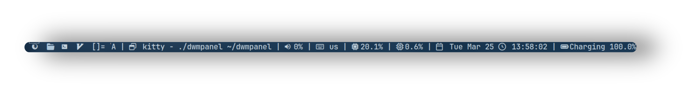

<div align="center">

# DWM - PANEL
### A custom made Python-based panel for dwm

<div align="center">




<div align="center">

## ⚙️ 𝙁𝙚𝙖𝙩𝙪𝙧𝙚𝙨

  -  𝗗𝗲𝘃𝗲𝗹𝗼𝗽𝗲𝗱 𝗳𝗿𝗼𝗺 𝗦𝗰𝗿𝗮𝘁𝗰𝗵 ⚙️
  -  𝗪𝗿𝗶𝘁𝘁𝗲𝗻 𝗶𝗻 𝗣𝘆𝘁𝗵𝗼𝗻 🐍
  -  𝗟𝗶𝗴𝗵𝘁𝘄𝗲𝗶𝗴𝗵𝘁 𝗮𝗻𝗱 𝗙𝗮𝘀𝘁 ⚡


##### 𝙄𝙣𝙨𝙩𝙖𝙡𝙡𝙖𝙩𝙞𝙤𝙣 🍃

```
curl -fsSL https://raw.githubusercontent.com/user7210unix/dwmpanel/main/install.sh | bash
```
